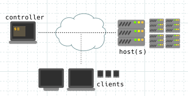

# Installation

This tool runs on an administration machine (_controller_), and uses [SSH](https://en.wikipedia.org/wiki/Secure_Shell) to configure remote servers (_hosts_) over the network.
 

- [Server preparation](installation/server-preparation.md)
- [Controller preparation](installation/controller-preparation.md)
- [Initial configuration and deployment](installation/first-project.md)
